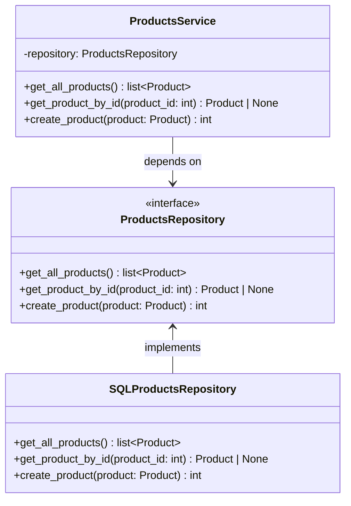
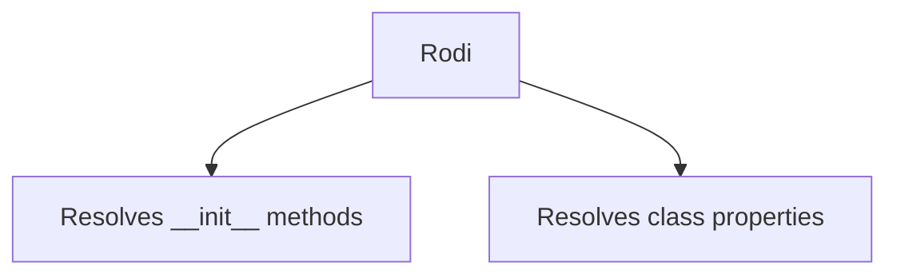

# Getting started with Rodi

This page introduces the basics of using Rodi, including:

- [X] An overview of dependency injection.
- [X] The use cases Rodi is intended for.

## Overview of dependency injection

Consider the following example:

```python
class A:
    ...


class B:
    def __init__(self, dependency: A):
        self.dependency = dependency
```

The type `B` depends upon the type `A`, because it requires an instance of `A`
in its constructor. In other words, `A` is a _dependency_ of `B`.

For a more concrete example, consider the following:

```python
class ProductsRepository:
    """Provides methods to read, write, and delete products information."""


class ProductsService:
    """Provides business logic for managing products."""

    def __init__(self, repository: ProductsRepository):
        self.repository = repository
```

The `ProductsService` requires an instance of `ProductsRepository`. The former
handles business logic, while the latter defines a type responsible for
storing, reading, and deleting product information.

Imagine we also need to send emails when certain events happen, the
`ProductsService` would likely have an additional dependency:

```python
class ProductsService:
    """Provides business logic for managing products."""

    def __init__(
        self,
        repository: ProductsRepository,
        email_handler: EmailHandler
    ):
        self.repository = repository
        self.email_handler = email_handler
```

Encapsulating the code that performs data access operations (`ProductsRepository`)
and that sends emails (`EmailHandler`) into dedicated classes is the right
approach, as the same functionality can be reused in other services (e.g.,
_OrdersService, AccountsService_) without duplicating code.

---

Dependencies _could also_ be instantiated by the classes that need them:

```python
class ProductsService:
    """Provides business logic for managing products."""

    def __init__(self):
        self.repository = ProductsRepository()
        self.email_handler = EmailHandler()
```

However, this approach has several limitations.

- **Scalability Issues**: As the application grows, managing dependencies
  manually within classes becomes cumbersome. It can lead to duplicated code
  and make the system harder to maintain.
- **Tight Coupling**: The `ProductsService` class is tightly coupled to
  _concrete_ implementations of its dependencies. This makes it less convenient
  to replace `ProductsRepository` and `EmailHandler` with different
  implementations (e.g., a mock for testing or a different database backend).
- **Reduced Testability**: Since dependencies are instantiated within the
  class, it is necessary to modify the properties of instances of
  `ProductsService`, to replace them with mocks or stubs during unit testing.
- **Lack of Flexibility**: If the application needs to use a different
  implementation of `ProductsRepository` (e.g., for different environments or
  configurations), the source code of the `ProductsService` class must be
  modified.
- **Code Duplication**: If multiple classes need the same dependency, each
  class would need to instantiate it, leading to duplicated code and increased
  maintenance overhead.
- **Configuration Management**: Managing configuration settings (e.g., database
  connection strings or API keys) becomes harder because they are scattered
  across multiple classes instead of being centralized.
- **Runtime Flexibility**: Instantiating dependencies directly in the class
  makes it harder to dynamically change or configure dependencies at runtime
  (e.g., switching to a different implementation based on environment
  variables).

Alternatively, dependencies could be instantiated at the module level and
managed as global variables.
Instantiating dependencies as globals at module level is generally not ideal,
as it leads to:

- **Tight Coupling to Global State**: When dependencies are global, any part of
  the application can access and modify them. This makes the code tightly
  coupled to the global state, leading to unpredictable behavior and bugs that
  are hard to trace.
- **Reduced Testability**: Global dependencies make unit testing difficult
  because tests cannot easily isolate or mock dependencies. Each test might
  inadvertently affect or be affected by the global state, leading to flaky
  tests.

Dependency injection can help addressing the problems listed above.

### Inversion of Control

**Inversion of Control (IoC)** is a design principle in which the control of
object creation and dependency management is inverted from the class itself to
an external entity, such as a framework or container. Instead of a class
instantiating its dependencies directly, they are provided to the class from
the outside. This promotes loose coupling and enhances testability.
**Dependency Injection** is a common implementation of IoC.

### Dependency Injection

**Dependency Injection** is a design principle where a class does not create
its own dependencies. Instead, the dependencies are provided (or "injected")
into the class from the outside. This makes the class more flexible, easier to
test, and less dependent on specific implementations.

If we consider again the classes `A` and `B` described earlier, they can be
registered and resolved using Rodi this way:

```python
# example1.py
class A:
    ...


class B:
    def __init__(self, dependency: A):
        self.dependency = dependency
```

```python
# main.py
from example1 import A, B

from rodi import Container


container = Container()

# register types:
container.add_transient(A)
container.add_transient(B)

# resolve B
example = container.resolve(B)

# the container automatically resolves dependencies
assert isinstance(example, B)
assert isinstance(example.dependency, A)
```

/// admonition | Completely non-intrusive.
    type: tip

Notice that Rodi is completely non-intrusive and does **not** require any changes to the
source code of the types it handles. This was one of the library's primary design goals.
///

In this example, both `A` and `B` are concrete types. Rodi can resolve concrete
types without any issues. However, the true power of dependency injection
becomes evident when we use _abstract types_ or _interfaces_ to define
dependencies. Let's talk about the _Dependency Inversion Principle_.

### Dependency Inversion Principle

The **Dependency Inversion Principle (DIP)** is a design principle that says
high-level modules (like business logic) should not depend on low-level modules
(like database access). Instead, _both_ should depend on abstractions, like
interfaces or abstract classes. This makes the code more flexible and easier
to change because you can swap out the low-level details without affecting the
high-level logic. Inversion of Control aligns with the Dependency Inversion
Principle.

Consider the following example, of `ProductsService`, `ProductsRepository`,
and `SQLProductsRepository`.

```python  {linenums="1", hl_lines="14-15 34-35"}
# domain/products.py
from abc import ABC, abstractmethod
from dataclasses import dataclass


@dataclass
class Product:
    id: int
    name: str
    description: str
    price: float


# Abstraction: ProductsRepository
class ProductsRepository(ABC):
    """
    Abstract base class for product repositories.
    Defines the interface for data access operations.
    """

    @abstractmethod
    def get_all_products(self) -> list[Product]:
        """Retrieve all products."""

    @abstractmethod
    def get_product_by_id(self, product_id: int) -> Product | None:
        """Retrieve a product by its ID."""

    @abstractmethod
    def create_product(self, product: Product) -> int:
        """Create a new product."""


# High-level module: ProductsService
class ProductsService:
    """
    Provides business logic for managing products.
    Depends on an abstract ProductsRepository.
    """

    def __init__(self, repository: ProductsRepository):
        self.repository = repository

    def get_all_products(self) -> list[Product]:
        """Retrieve all products."""
        return self.repository.get_all_products()

    def get_product_by_id(self, product_id: int) -> Product | None:
        """Retrieve a product by its ID."""
        return self.repository.get_product_by_id(product_id)

    def create_product(self, product: Product) -> int:
        """Create a new product."""
        return self.repository.create_product(product)

```

```python  {linenums="1", hl_lines="5-6"}
# data/sql/products.py
from domain.products import Product, ProductsRepository


# Low-level module: SQLProductsRepository
class SQLProductsRepository(ProductsRepository):
    """
    Concrete implementation of ProductsRepository using a SQL database.
    """

    def __init__(self, db_connection):
        self.db_connection = db_connection

    def get_all_products(self) -> list[Product]:
        """Retrieve all products from the database."""
        cursor = self.db_connection.cursor()
        cursor.execute("SELECT id, name, description, price FROM products")
        rows = cursor.fetchall()
        return [
            Product(id=row[0], name=row[1], description=row[2], price=row[3])
            for row in rows
        ]

    def get_product_by_id(self, product_id: int) -> Product | None:
        """Retrieve a product by its ID."""
        cursor = self.db_connection.cursor()
        cursor.execute(
            "SELECT id, name, description, price FROM products WHERE id = ?",
            (product_id,),
        )
        row = cursor.fetchone()
        if row:
            return Product(id=row[0], name=row[1], description=row[2], price=row[3])
        return None

    def create_product(self, product: Product) -> int:
        """Insert a new product into the database."""
        cursor = self.db_connection.cursor()
        cursor.execute(
            "INSERT INTO products (name, description, price) VALUES (?, ?, ?)",
            (product.name, product.description, product.price),
        )
        self.db_connection.commit()
        return cursor.lastrowid
```

**Explanation:**

- The **abstraction `ProductsRepository`** defines the interface for data
  access operations.
- The **high-level class (`ProductsService`)** depends on this abstraction, not
  on concrete implementations.
- The **high-level class (`ProductsService`)** implements business logic and
  depends on the `ProductsRepository` abstraction.
- `ProductsService` does not depend on the details of how data is stored or
  retrieved, and it is not _concerned_ with those details.
- The low-level class (`SQLProductsRepository`) implements the
  `ProductsRepository` interface using an SQL database.
- It can be swapped out for another implementation (e.g.,
  `InMemoryProductsRepository`) without modifying the `ProductsService`.



The benefits of DIP are:

- **Loose Coupling**: The `ProductsService` is decoupled from the specific
  implementation of the repository.
- **Flexibility**: You can easily replace `SQLProductsRepository` with another
  implementation (e.g., a mock for testing).
- **Testability**: The `ProductsService` can be tested independently by
  injecting a mock or stub implementation of `ProductsRepository`.

To better understand the concept, consider the following example that shows how
those classes can be imported and instantiated:

```python  {linenums="1", hl_lines="19-20 22-23"}
import sqlite3

from data.sql.products import SQLProductsRepository
from domain.products import Product, ProductsService

# Set up an SQLite database connection
connection = sqlite3.connect(":memory:")
connection.execute(
    """
    CREATE TABLE products (
        id INTEGER PRIMARY KEY,
        name TEXT NOT NULL,
        description TEXT,
        price REAL NOT NULL
    )
    """
)

# Instantiate the low-level module (SQLProductsRepository)
sql_repository = SQLProductsRepository(connection)

# Instantiate the high-level module (ProductsService)
service = ProductsService(sql_repository)

# Use the service
new_product = Product(
    id=0, name="Laptop", description="A powerful laptop", price=1200.00
)
product_id = service.create_product(new_product)
print(service.get_product_by_id(product_id))
print(service.get_all_products())
```

As the number of dependencies grow, the code that instantiates objects can
easily become hard to maintain. To simplify the management of dependencies and
reduce the complexity of object instantiation, we can leverage a dependency
injection framework like Rodi.

### The Repository pattern example

The three classes described above: `ProductsService`, `ProductsRepository`, and
`SQLProductsRepository`, can be wired using Rodi this way:

```python {linenums="1", hl_lines="9 12 28-29 31 36"}
import sqlite3

from rodi import Container

from data.sql.products import SQLProductsRepository
from domain.products import Product, ProductsRepository, ProductsService


container = Container()


def connection_factory() -> sqlite3.Connection:
    """Create a new SQLite database connection."""
    conn = sqlite3.connect(":memory:")
    conn.execute(
        """
        CREATE TABLE products (
            id INTEGER PRIMARY KEY,
            name TEXT NOT NULL,
            description TEXT,
            price REAL NOT NULL
        )
        """
    )
    return conn


container.add_transient_by_factory(connection_factory)
container.add_alias("db_connection", sqlite3.Connection)

container.add_transient(ProductsRepository, SQLProductsRepository)
container.add_transient(ProductsService)


# Obtain an instance of the service
service = container.resolve(ProductsService)

# Use the service
new_product = Product(
    id=0, name="Laptop", description="A powerful laptop", price=1200.00
)
product_id = service.create_product(new_product)
print(service.get_product_by_id(product_id))
print(service.get_all_products())
```

Some interesting things are happening in this code:

- At line _9_, an instance of `rodi.Container` is created. This class is used
  to register the types that must be resolved, and to resolve those types.
- It was not necessary to modify the source code of the classes being handled:
  Rodi inspects the code of registered types to know how to resolve them.
- A factory function is used to define how the instance of `sqlite3.Connection`
  is to be created. This is convenient because the `connect` method, which
  returns an instance of that class, requires a `str`, and resolving base types
  with `DI` is not a good idea.
- The factory has a return type annotation: Rodi uses that type annotation
  as the _key type_ that is resolved using the factory function. Note that a factory
  might declare a more **abstract** type than the one it returns (following the DIP
  principle).
- Since the constructor of the `SQLProductsRepository` class does not include a type
  annotation for its `db_connection` dependency, an alias is configured at line _29_ to
  instruct the container to resolve parameters named `db_connection` as instances of
  `sqlite3.Connection`. Alternatively, we could have updated the source code of
  `SQLProductsRepository` to include a type annotation in its constructor.
- At line _31_, the **abstract** type `ProductsRepository` is registered,
  instructing the container to resolve that type with the **concrete**
  implementation `SQLProductsRepository`. According to the **DIP** principle,
  when registering an abstract type and its implementation, Rodi requires
  using the abstract type as _key_.
- At line _32_, the `ProductsService` type is also registered, because this is
  required to build the graph of dependencies.
- At line _36_, an instance of `ProductsService` is obtained through **DI**.
  Since this is the first time the `Container` needs to resolve a type, it runs
  code inspections to build the tree of dependencies. These code inspections
  are executed only once, unless new types are registered in the same
  `Container`. The container obtains all necessary objects: from the
  `db_connection` and the `SQLProductsRepository` to resolve the **abstract**
  dependency `ProductsRepository`, used to instantiate the requested
  `ProductsService`.

## Rodi's use cases

Rodi is designed to simplify objects instantiation and dependency management. It can
inspect constructors (`__init__` methods) and class properties to automatically resolve
dependencies.

Support for inspecting class properties is intended to reduce code verbosity. Note how
in the example below, it is necessary to write three times 'dependency':

```python
class A:
    ...


class B:
    def __init__(self, dependency: A):
        self.dependency = dependency
```

The same classes can be written this way:

```python
class A:
    ...

class B:
    dependency: A
```

Rodi would automatically instantiate `B` and populate its `dependency` property
with an instance of `A`.



=== "Using constructors"

    ```python {linenums="1", hl_lines="7-8"}
    from rodi import Container

    class A:
        ...

    class B:
        def __init__(self, dependency: A):
            self.dependency = dependency

    container = Container()

    container.add_transient(A)
    container.add_transient(B)

    example = container.resolve(B)
    assert isinstance(example, B)
    assert isinstance(example.dependency, A)
    ```

=== "Using class properties"

    ```python {linenums="1", hl_lines="7"}
    from rodi import Container

    class A:
        ...

    class B:
        dependency: A

    container = Container()

    container.add_transient(A)
    container.add_transient(B)

    example = container.resolve(B)
    assert isinstance(example, B)
    assert isinstance(example.dependency, A)
    ```

### Container lifetime

The primary use case of Rodi is to instantiate a single `Container` object, configure it
with all required dependencies at application startup, and maintain it in an immutable
state throughout the application's lifetime. It is anyway possible to work with multiple
containers, and to modify them even after the dependency graph has been built. Modifying
a `Container` after the dependency graph has been built is an anti-pattern and can lead
to unexpected behaviour. More details on this subject are provided in the next page.

### Sync vs Async

Rodi is designed for synchronous code. It intentionally does not provide an asynchronous
code API because object constructors should be lightweight and run synchronously.
Supporting asynchronous type resolution would introduce performance overhead due to the
complexity of asynchronous operations, and the extra machinery they require.

Constructors (`__init__` methods) are typically designed to be lightweight and avoid
CPU intensive blocking operations or performing I/O operations.

### Type annotations

Rodi can use both type annotations and naming conventions to build graphs of
dependencies.

Type annotations is the recommended way to keep the code clean and explicit.

=== "Using type annotations (recommended)"

    ```python {linenums="1", hl_lines="7"}
    from rodi import Container

    class A:
        ...

    class B:
        def __init__(self, dependency: A):  # <-- with type annotation
            self.dependency = dependency

    container = Container()

    container.add_transient(A)
    container.add_transient(B)

    example = container.resolve(B)
    assert isinstance(example, B)
    assert isinstance(example.dependency, A)
    ```

=== "Using naming conventions"

    ```python {linenums="1", hl_lines="7-8 12-13"}
    from rodi import Container

    class A:
        ...

    class B:
        def __init__(self, dependency):  # <-- no type annotation
            self.dependency = dependency

    container = Container()

    container.add_transient(A)
    container.add_alias("dependency", A)  # <-- required to resolve
    container.add_transient(B)

    example = container.resolve(B)
    assert isinstance(example, B)
    assert isinstance(example.dependency, A)
    ```

### Automatic aliases

Rodi supports automatic aliases. When a type is registered, the container creates a
set of aliases based on the class name. Consider the following example:

```python {linenums="1", hl_lines="4 8-9"}
from rodi import Container


class CatsRepository: ...


class B:
    def __init__(self, cats_repository):
        self.cats_repository = cats_repository


container = Container()

container.add_transient(CatsRepository)
container.add_transient(B)

example = container.resolve(B)
assert isinstance(example, B)
assert isinstance(example.cats_repository, CatsRepository)
```

Aliases are only used when type annotations are missing. They serve solely as a
*fallback* and always refer to a type that can be resolved.

This design decision is based on the assumption that classes *usually* have names that
are distinct enough to be unambiguously identified, even across namespaces.

In the example above, the following set of aliases is created for the registered types:

```python
{
  'CatsRepository': {<class '__main__.CatsRepository'>},
  'catsrepository': {<class '__main__.CatsRepository'>},
  'cats_repository': {<class '__main__.CatsRepository'>},
  'B': {<class '__main__.B'>},
  'b': {<class '__main__.B'>}
}
```

/// admonition | Disabling automatic aliases.
    type: tip

Some programmers might dislike the automatic aliasing feature, as it can lead to
unexpected behavior if naming conventions are not followed consistently. To disable this
feature, set the `strict` parameter to `True` when creating the container:

```python
container = Container(strict=True)
```
///

## Summary

This page covered the ABCs of Dependency Injection and Rodi. The general concepts
presented here apply to others DI frameworks as well.

The next page will start diving into Rodi's details, starting with explaining how to
[register types](./registering-types.md).
